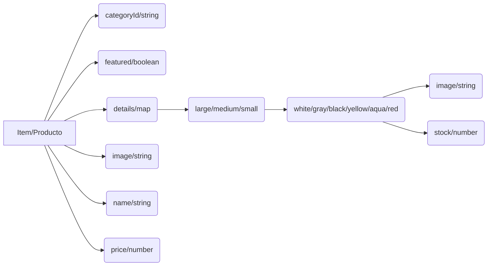

# Bienvenido a Geekers!
Somos una tienda virtual de remeras nerd de primera calidad.

## Estructura de Productos en DB (Firebase)
Es importante mantener la estructura de la carga de productos para un correcto funcionamiento. 
Dejamos el siguiente diagrama a modo de ejemplo.

> **Tip:** En la carpeta _utils_ hay un archivo para configurar nuevos productos desde la aplicación sin tener que acceder a Firebase "manualmente".

## Categorías
Las categorías se cargan desde la colección _categories_. Actualmente tenemos 2 categorías (propiedad _categoryId_ del producto) y una tercera (_featured_) que es una propiedad aparte que comparten todos los items y se expresa en valores booleanos.
> **Tip:** Se podrían seguir agregando nuevas categorías. Por ej. "Niños".

## Talles y Colores
Para poder agregar productos al carrito, primero se debe elegir el talle y el color para que habilite el stock correspondiente a esa combinación.

## ¿Por qué modificamos la estructura de los items en el carrito?
Al agregarle las propiedades _size_ y _color_ a cada elemento del carrito nos permite una validación más (aparte del id) para no repetir el mismo ítem pero que a su vez si la misma remera en el mismo talle es seleccionada en 2 colores distintos, la aplicación tome 2 ítems por separado y  así luego poder hacer el control de stock correspondiente.

## Control de Stock
El stock es individual para cada combinación de producto. O sea:
Remera --> Unisex ó Mujer --> Talle --> Color --> Stock.

## Productos agregados al carrito
Hasta no estar realizado el _commit_ del stock en el checkout, el botón de agregar productos sigue tomando el valor del stock actual que figura en Firebase. Sin embargo en el checkout no agrega más que el stock disponible y aclara al usuario que ese es el número máximo de ese ítem.
Remera --> Unisex ó Mujer --> Talle --> Color --> Stock.
